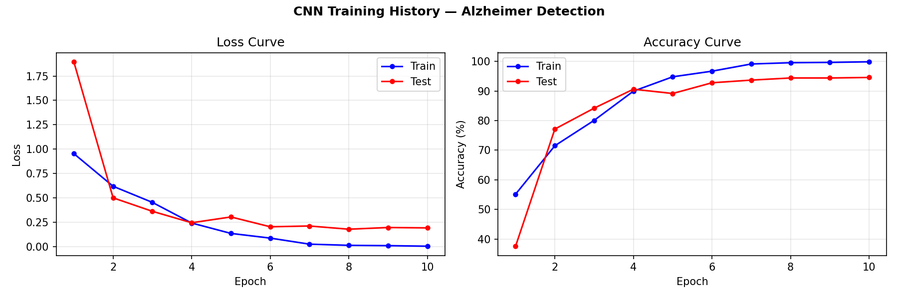
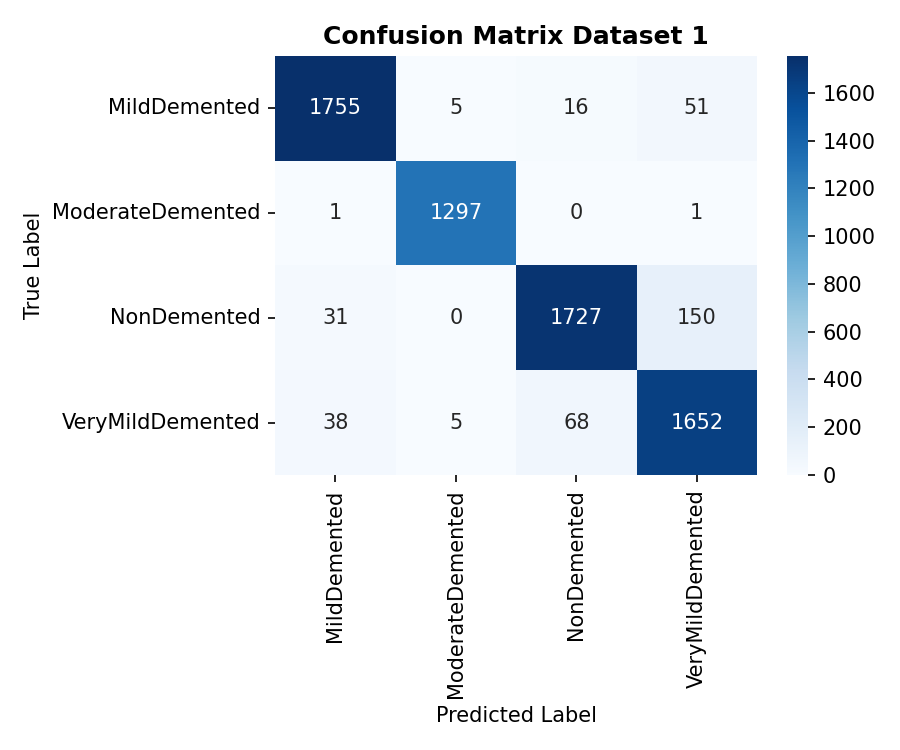
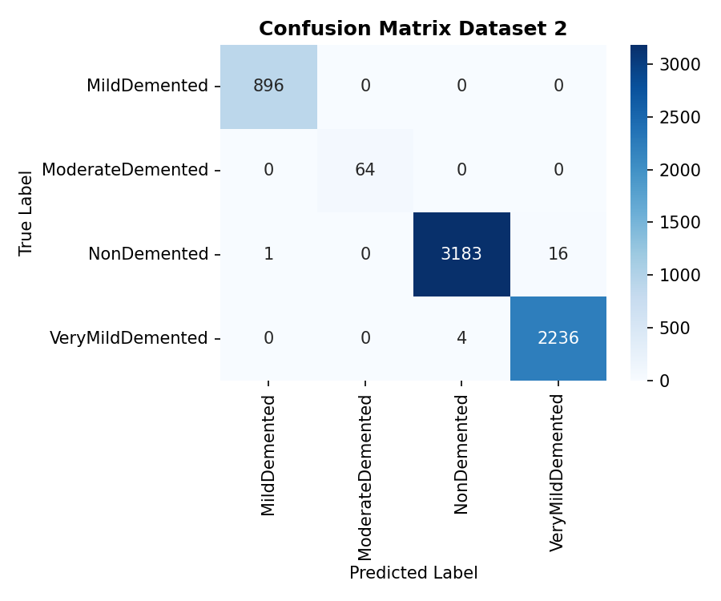

# 🧠 Alzheimer's Stage Classification using a Custom CNN

A PyTorch-based deep learning project that classifies brain MRI scans into four Alzheimer's disease stages using a custom-built Convolutional Neural Network. The model is trained on one dataset and validated on a **completely independent, unseen dataset** to test real-world generalization.

## 🎯 Problem Statement

Alzheimer's disease progresses through distinct stages, and early detection from MRI scans can support faster clinical decision-making. This project builds an end-to-end deep learning pipeline to classify brain MRI images into four categories:

- **NonDemented**
- **VeryMildDemented**
- **MildDemented**
- **ModerateDemented**

## 📊 Datasets

| Dataset | Role | Size | Source |
|---|---|---|---|
| Mendeley Augmented Alzheimer Dataset | Train + Test | 27,187 train / 6,797 test | [Mendeley Data](https://data.mendeley.com/datasets/ch87yswbz4/1) |
| OASIS | Independent validation (unseen) | 6,400 images | [Kaggle](https://www.kaggle.com/datasets/ninadaithal/imagesoasis) |

Using a second, independent dataset for validation (rather than just a train/test split from the same source) was a deliberate choice to check whether the model generalizes to MRI scans from a different acquisition pipeline, rather than just memorizing dataset-specific artifacts.

## 🏗️ Model Architecture

A custom CNN built from scratch in PyTorch (no pretrained backbone):

```
Input (1×64×64 grayscale MRI)
   │
Block 1: Conv(1→32)   → BatchNorm → ReLU → MaxPool   →  32×32
Block 2: Conv(32→64)  → BatchNorm → ReLU → MaxPool   →  16×16
Block 3: Conv(64→128) → BatchNorm → ReLU → MaxPool   →   8×8
Block 4: Conv(128→256)→ BatchNorm → ReLU → MaxPool   →   4×4
   │
Flatten → Dropout(0.5) → FC(4096→512) → ReLU → FC(512→4)
```

**Training setup:** Adam optimizer, StepLR scheduler, CrossEntropy loss, 10 epochs, batch size 64, data augmentation (random horizontal flip + rotation) on the training set.

## 🚀 Results

| Metric | Score |
|---|---|
| Mendeley Test Accuracy | **93.22%** |
| OASIS (unseen) Validation Accuracy | **98.69%** |

### Training Curves


### Confusion Matrix — Mendeley Test Set


### Confusion Matrix — OASIS Validation Set


Most misclassifications occur between **adjacent severity stages** (e.g. VeryMildDemented ↔ NonDemented, MildDemented ↔ VeryMildDemented), which aligns with the clinical reality that these stages are visually similar on MRI — rather than indicating random model error.

### Why is OASIS accuracy higher than the Mendeley test accuracy?

At first glance, the OASIS validation accuracy looks better than the Mendeley test accuracy, but this is **not because the model generalizes better** — it's a class imbalance effect:

| Dataset | NonDemented share | ModerateDemented share | Largest class share |
|---|---|---|---|
| Mendeley (test) | 28.1% | 19.1% | 28.1% |
| OASIS (validation) | 50.0% | 1.0% | 50.0% |

OASIS is dominated by a single class (50% NonDemented), so a model only needs to be reliable on that one majority class to post a high overall accuracy. Mendeley's test set is fairly balanced across all four classes, which makes it a more honest measure of model performance.

Looking at **per-class accuracy** on Mendeley reveals the model's real weak spot: it drops to ~90–94% specifically on **NonDemented** and **VeryMildDemented** — the two stages that look most visually similar on MRI (subtle, early-stage atrophy is genuinely hard to distinguish from a healthy scan). On OASIS, the model scores 99%+ on every individual class, suggesting those images may also be more consistent/cleaner, not just that the model learned a more general representation.

**Takeaway:** the Mendeley balanced test accuracy (93.2%) is the more meaningful number for judging model quality; the OASIS score should be read as "performs near-perfectly on an imbalanced, majority-class-heavy set" rather than "generalizes better."

## 📁 Repository Structure

```
.
├── Alzheimers_Detection_CNN.ipynb   # Step-by-step exploration, training, evaluation
├── train.py                          # End-to-end training & evaluation script
├── best_cnn_model.pth                # Saved model weights (best checkpoint)
├── training_history.png              # Loss & accuracy curves
├── confusion_matrix_dataset_1.png    # Mendeley test set confusion matrix
├── confusion_matrix_dataset_2.png    # OASIS validation confusion matrix
├── requirements.txt
└── README.md
```

## 🛠️ Setup & Installation

1. Clone the repository:
   ```bash
   git clone https://github.com/<your-username>/<your-repo-name>.git
   cd <your-repo-name>
   ```

2. Install dependencies:
   ```bash
   pip install -r requirements.txt
   ```

3. Download the datasets and place them in the project root:
   - Mendeley dataset folder → rename to `AugmentedAlzheimerDataset`
   - OASIS dataset folder → rename to `OriginalDataset`

## 💻 Usage

**Run the full pipeline (train + evaluate + plots):**
```bash
python train.py
```

**Or explore interactively:**
```bash
jupyter notebook Alzheimers_Detection_CNN.ipynb
```

**Load the trained model for inference:**
```python
import torch
from train import AlzheimerCNN

model = AlzheimerCNN(num_classes=4)
model.load_state_dict(torch.load("best_cnn_model.pth", map_location="cpu"))
model.eval()
```

## 🔭 Future Improvements

- Experiment with transfer learning (ResNet/EfficientNet) as a stronger baseline comparison
- Add Grad-CAM visualizations for model interpretability
- Address class imbalance (ModerateDemented is underrepresented) with weighted loss or oversampling
- Deploy as a simple inference API/demo


## 🧰 Tech Stack

`Python` · `PyTorch` · `torchvision` · `scikit-learn` · `NumPy` · `Matplotlib` · `Seaborn`
